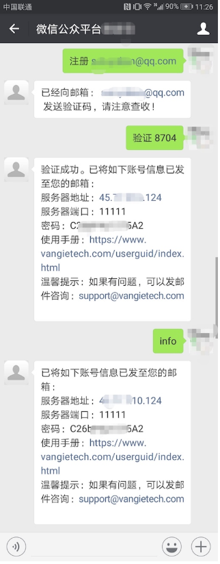
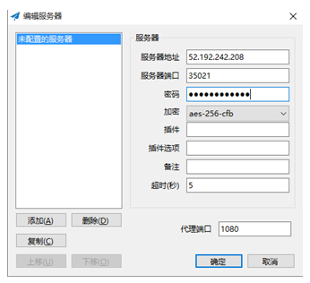
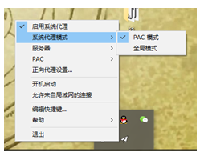

客户端使用指导
===

## 使用前必读  
关注我们的公众号（回复“获取密钥”）可以获取试用账号（试用期一个月）：  
1. 扫描关注公众号  

2. 按如下步骤操作注册账号  

## 客户端下载  
[win 10客户端下载](http://ss.vangietech.com/userguid/download/windows/Shadowsocks.exe)  
[win 7客户端推荐下载](http://ss.vangietech.com/userguid/download/windows/Shadowsocks-3.0.zip)  
[windows 其他更多版本](https://github.com/shadowsocks/shadowsocks-windows/releases)  注：如客户端在您的电脑上无法运行，请尝试更换其他版本客户端，win 7推荐3.0及以上但不要超出4.0，win 10推荐4.0及以上  
[android apk客户端下载](http://ss.vangietech.com/userguid/download/android/shadowsocks.apk)  
[MacOSX客户端下载](http://ss.vangietech.com/userguid/download/mac/ShadowsocksX-2.6.3.dmg)  

## Windows 客户端使用方法：  
  
如上图填写好账号信息，点击确定。  
  
这时客户端会隐藏在右下角，点击启动系统代理。   
注意：系统代理模式一定要选择PAC模式，否则我们正常访问国内的网站也会经过代理，这样会减慢国内网页的访问速度。  

## Android客户端使用方法：  
  
这里就注意一点：功能设置-路由 要设置为：仅代理中国大陆无法访问网址

## 关于收费
- 12元/1月 30元/3月 50元/6月
- **扫码付费时，请务必在备注中写明注册时的邮箱，否则无法为您的账号续期。**
- 微信付款二维码  

